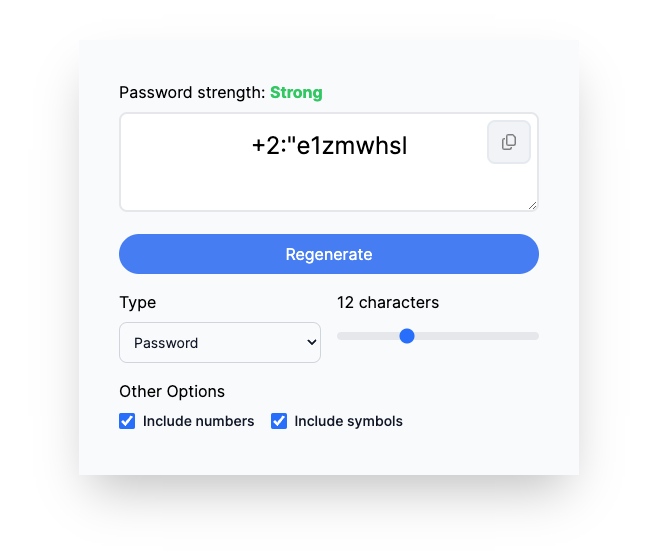

# Password Generator



This repository contains code to preview and build a web-based password generator, as well as having some common set of configuration to successfully deploy it to popular cloud frontend platforms, such as Vercel and Netlify.

## Getting Started

To get started, `cd` into the `frontend` folder, and then run the following to install the local dependencies.

```bash
npm install
```

## Developing and Previewing

To preview the app, assuming you have invoked `npm install`, then you should be able to run the following in the local dependencies.

```bash
npm run dev
```

Pay close attention to the terminal, and in it, you should see the URL in which the application is hosted. It typically is `https://localhost:3000`, but Next.js could end up selecting something else, usually because port 3000 is occupied.
